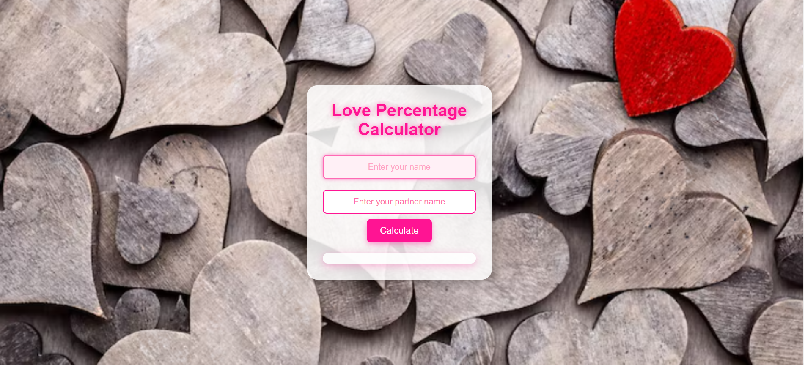

# Love Percentage Calculator ❤️

A responsive and interactive Love Percentage Calculator built using HTML, CSS, and JavaScript. This project features a modern romantic UI, smooth animations, keyboard support, and localStorage-based history tracking.

---

## Preview



---

## Features

- Responsive Design
- Romantic UI Design
- Random Love Percentage Generator
- Smooth Animations
- Keyboard Interaction Support
- LocalStorage History Tracking
- Background Image Support
- Mobile Friendly Layout

---

## Technologies Used

- HTML5
- CSS3
- JavaScript
- LocalStorage API

---

## How to Run

1. Clone the repository

```bash
git clone https://github.com/Rorychhattish/love-percentage-calculator.git
```

2. Open the project folder
3. Run index.html in your browser

## Connect With Me
- GitHub: https://github.com/Rorychhattish
- YouTube: https://www.youtube.com/@Hackwith36

## Developer
Developed by Rory Chhattish ❤️